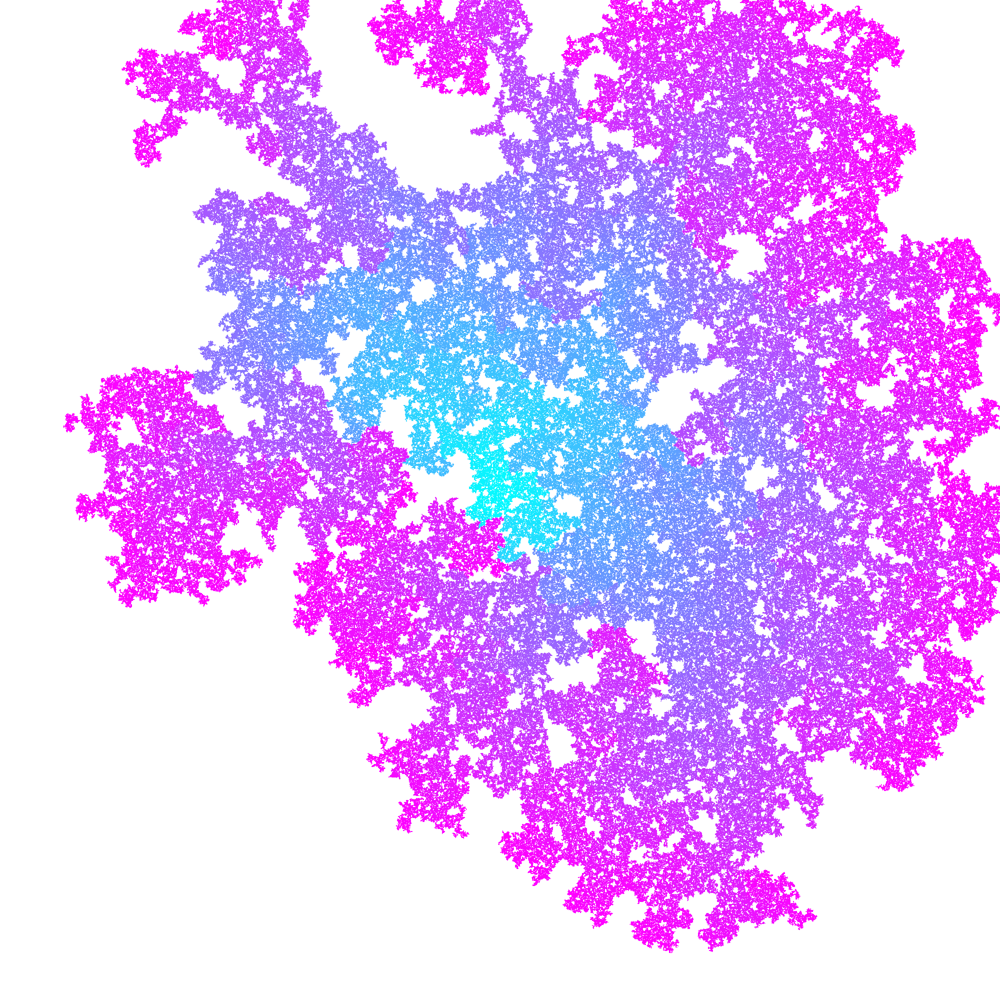
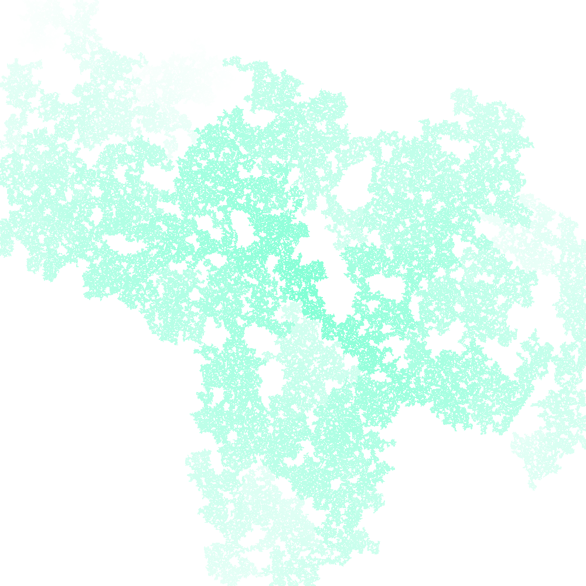
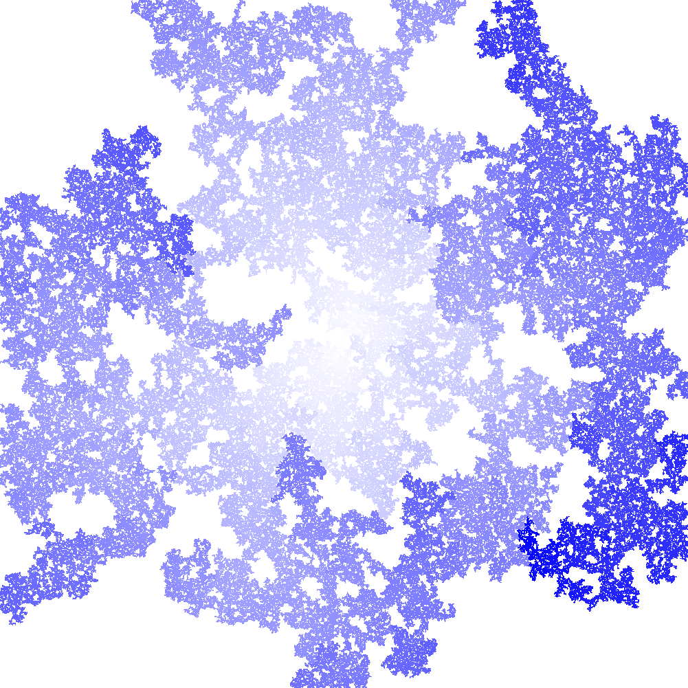
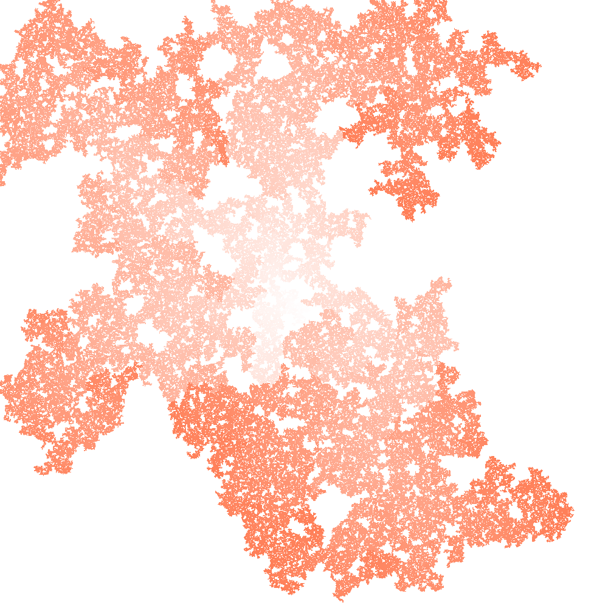
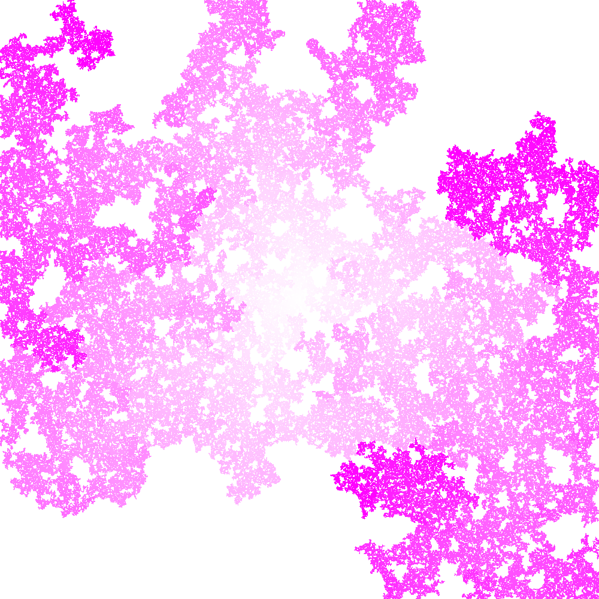
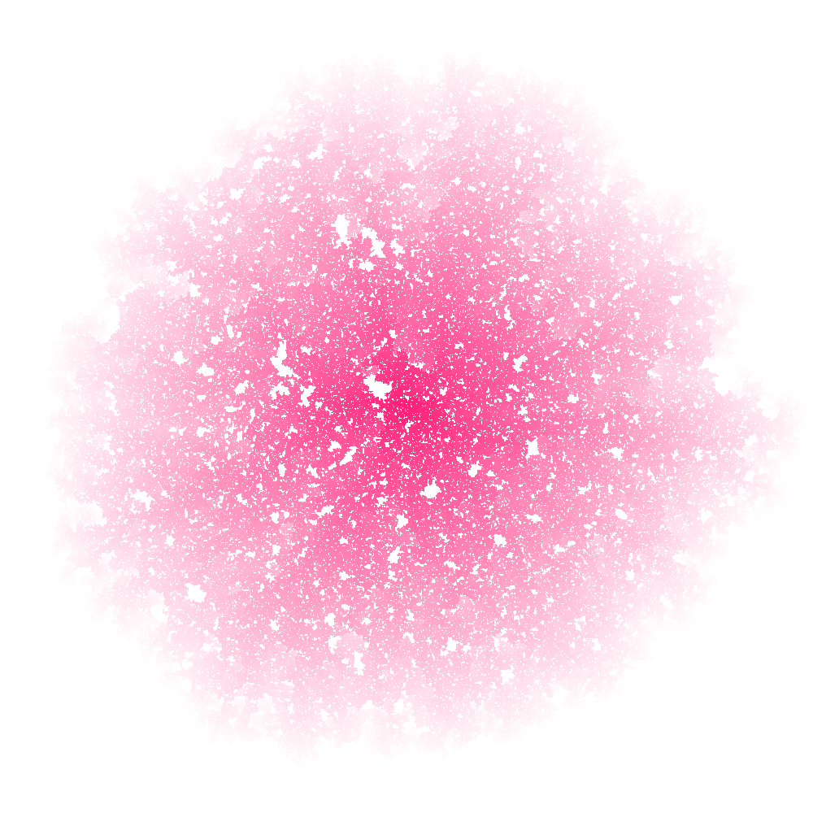
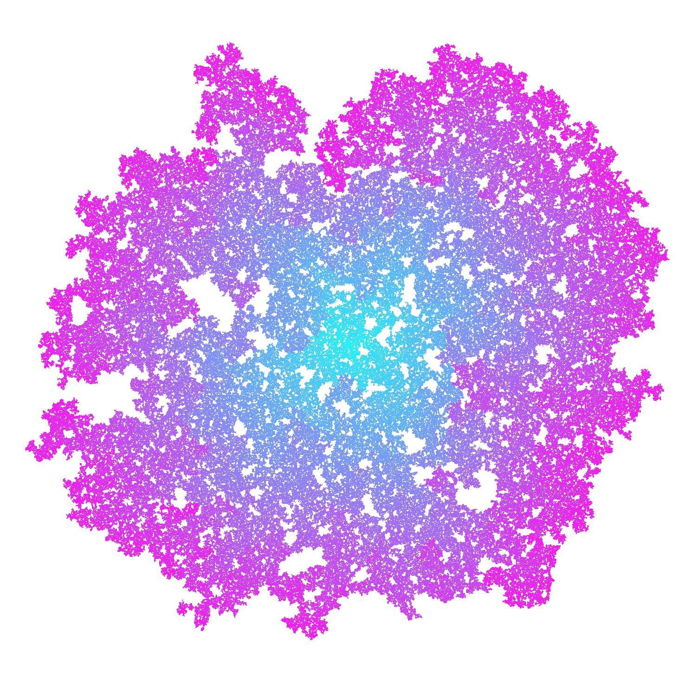

# Square colony
Visualization of an interesting mathematical idea.

## Idea
>The original idea was found [here](https://vk.com/math_dosug?w=wall-149993556_46382)

Let a square be surrounded on each side by a new square of the same size with a chance of **q**. Newly formed squares reproduce other squares and so on, to infinity.  
We will limit the growth of the population by setting a certain maximum allowable number of squares, upon reaching which the program will be completed.

As you probably noticed when looking at the images below, the edges of the shapes are more duller then its centre and, conversely, the center of the shape is duller than its edges on in some images. The fact is that with each generation, squares are created more white or more 'colored' specifically so that the process of structure development is visualized.

## Remarks
With **q** tending to **1**, the structure becomes more and more like a *rhombus*, that is not really surprising.  
If the **q** is less than **0.5**, then the structure is *unlikely to grow*.  
If **q** approximately equal to **0.5**, the structure is *complete chaos*.  
With **q** approximately equal to **0.6**, the structure resembles a *circle*.  
If **q** is in **\[0.7, 1)**, the the structure looks like a *convex rhombus*.  
If **q** is equals to **1**, the structure becomes a *rhombus*.

## Usage
1. Upgrade required packages with `pip install -r requirements.txt --upgrade` (if you don't have one, it will be automatically installed).
2. Open the folder with the scripts.
3. Check out all the command-line parameters.
4. Run the `main.py` with `python main.py --help` and read the description with all the parameters.
5. Run the `main.py` again with the parameters you need.
6. Enjoy the beauty.

## Command-line arguments description
```
positional arguments:
  width                 The width of the image
  height                The height of the image

optional arguments:
  -h, --help            show this help message and exit
  -rc RC, --reproduce-chance RC
                        The chance the square can produce other squares
  -mpc MPC, --max-population-count MPC
                        The maximum number of squares in the image
  -ca R G B, --color-accent R G B
                        The color of squares
  -cb R G B A, --color-background R G B A
                        The background color
  -fp FP, --find-percent FP
                        The program will work until a colony is filled with a
                        certain percentage
  -fi, --fade-in        The original color is white. The color of each new
                        generation will fade into the specified color
  -s, --save            The generated image will be saved in the root
  -p PATH, --path PATH  The path by which the generated image will be saved
```

## Gallery (images created by this program)








