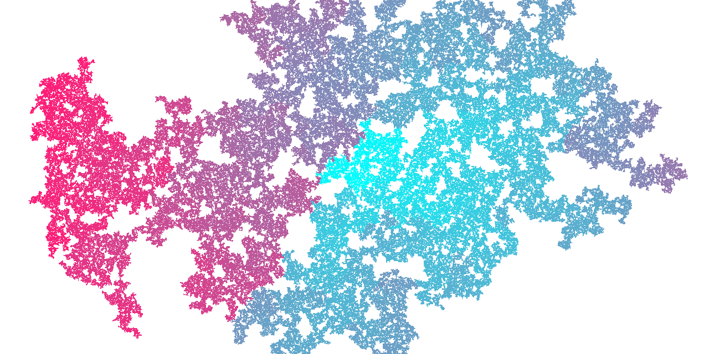
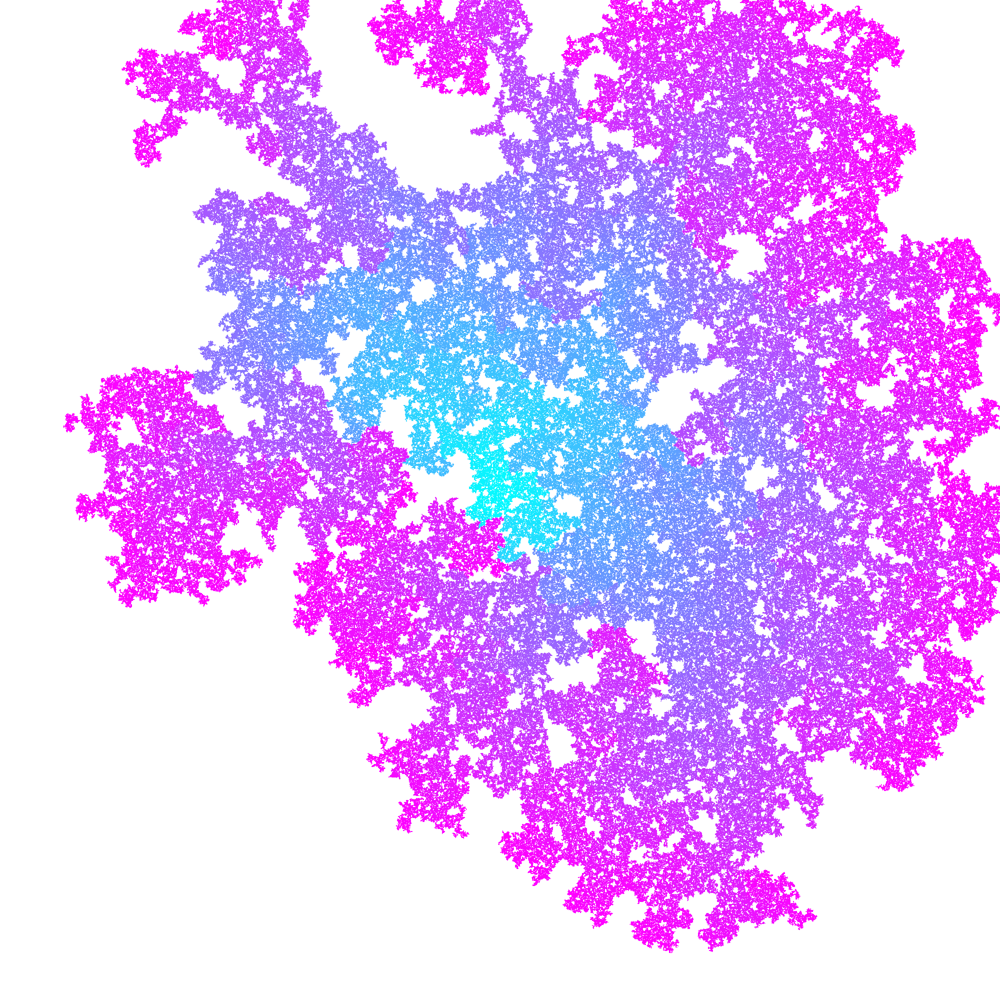
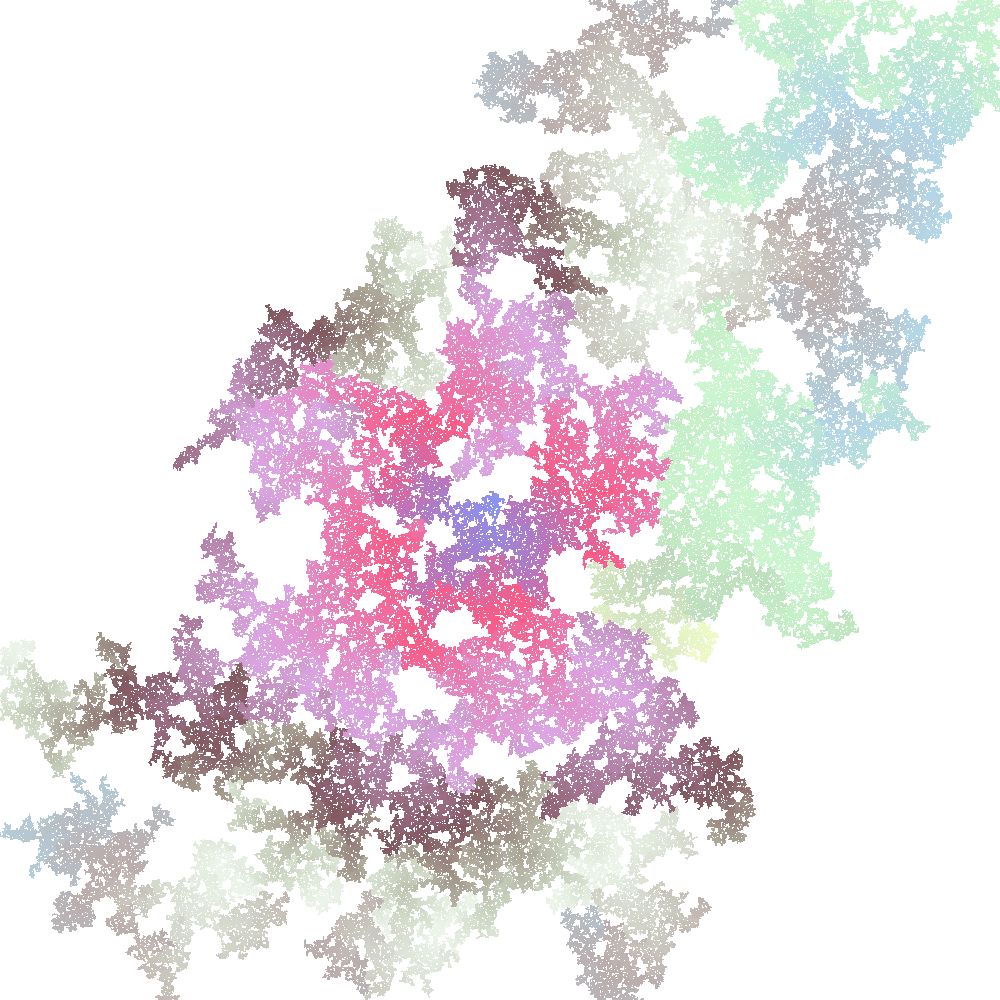
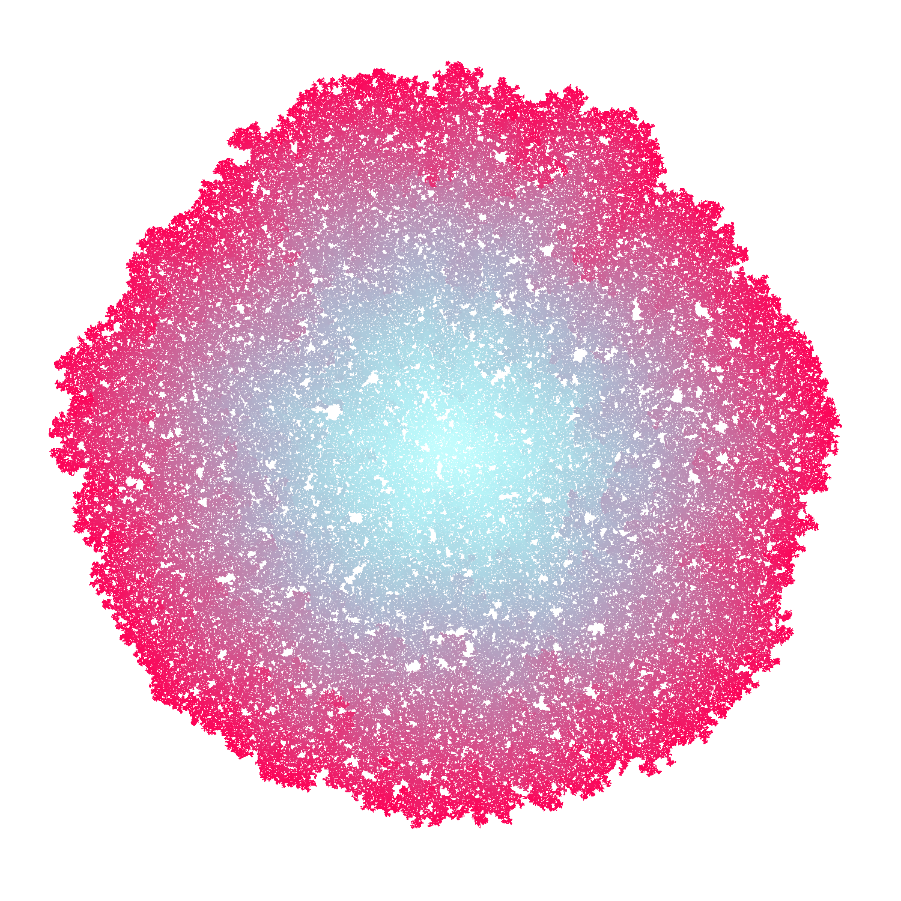
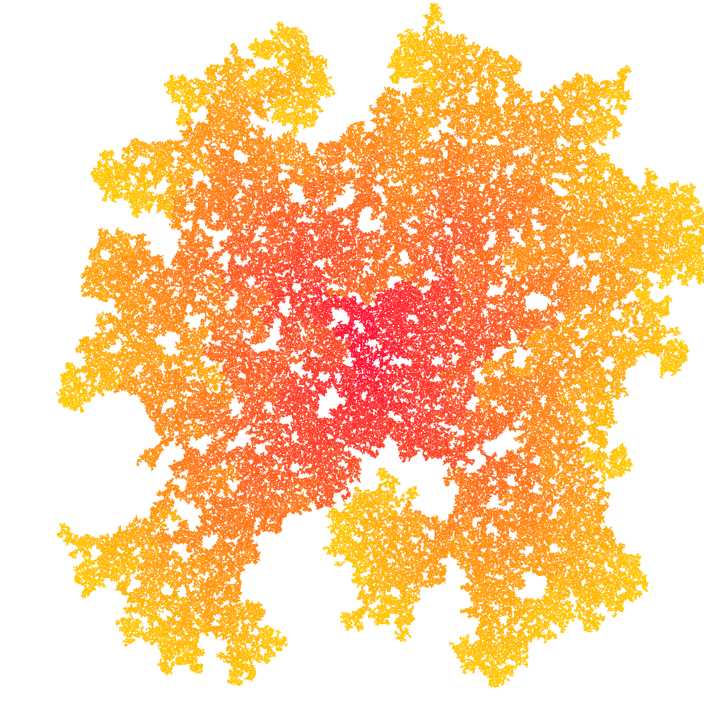
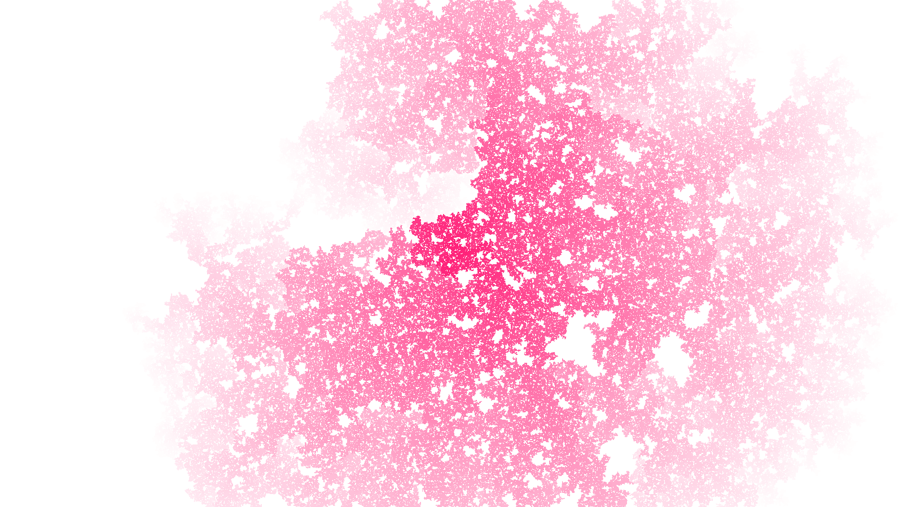

# Nebular Automata

`A program for visualizing an interesting mathematical idea`



## Table of contents

- [My Telegram channel](#my-telegram-channel)
- [Idea](#idea)
- [Some remarks](#some-remarks)
- [Usage](#usage)
  - [Installation](#installation)
  - [Usage of renderer](#usage-of-renderer-rendererpy)
- [Command-line arguments description](#command-line-arguments-description)
- [Credits and references](#credits-and-references)
- [License](#license)
- [Gallery](#gallery-images-created-by-this-program)

## My Telegram channel

I created a [Telegram channel](https://t.me/nebular_automata) in which the bot generates and uploads images with detailed characteristics every two hours.

## Idea

> The original idea was found [here](https://vk.com/math_dosug?w=wall-149993556_46382), and the author is this [person](https://vk.com/id504076319).

Let a square be surrounded on each side by a new square of the same size with a chance of **q**. Newly formed squares reproduce other squares and so on, to infinity.
We will limit the growth of the population by setting a certain maximum allowable number of squares, upon reaching which the program will be completed.

As you probably noticed when looking at the images [below](#gallery-images-created-by-this-program), the edges of the shapes have a different color, into which the initial color smoothly flows. This was done not only to illustrate the process of structure development, but also for greater saturation and prettiness of images.

## Some remarks

With **q** tending to **1**, the structure becomes more and more like a *rhombus*, that is not really surprising.
If the **q** is less than **0.5**, then the structure is *unlikely to grow*.
If **q** approximately equal to **0.5**, the structure is *complete chaos*.
With **q** approximately equal to **0.6**, the structure resembles a *circle*.
If **q** is in **\[0.7, 1)**, the the structure looks like a *convex rhombus*.
If **q** is equals to **1**, the structure becomes a *rhombus*.

In fact, we can also generate squares if we surround each square not only on each side, but also on each corner. Therefore, I added an additional `--quadratic` parameter to generate squares.

## Usage

### Installation

Upgrade required packages with `pip install -r requirements.txt --upgrade` (if you don't have one, it will be automatically installed).

### Usage of renderer ([`renderer.py`](src/renderer.py))

1. Check out all the command-line parameters [below](#command-line-arguments-description).
2. Then you can specify the colors you need in the [`colors_config.json`](configs/colors_config.json).
3. Run the `renderer.py` with `python src/renderer.py [parameters you need]`.
4. Enjoy the beauty.

## Command-line arguments description

```
usage: renderer.py [-h] [-sp X Y] [-rc FLOAT] [-mc INT] [-r] [-rbg] [-cn INT] [-o] [-minp FLOAT] [-maxp FLOAT] [-fi] [-q] [-s] [-p PATH] [-dsi] width height

Creates a beautiful nebula. Percentages show the duration of further program execution in ideal conditions! In fact, probability can take its toll.

options:
  -h, --help            show this help message and exit

Required options:
  width                 The width of the image.
  height                The height of the image.

Basic options:
  -sp X Y, --starting-point X Y
                        The coordinate of a starting point. By default it's in the middle.
  -rc FLOAT, --reproduce-chance FLOAT
                        The chance the square can produce other squares. By default it's 0.51
  -mc INT, --max-count INT
                        The maximum number of squares in the image. By default, this is half of all pixels in the future image.

Multicoloring options:
  -r, --random-colors   All colors will be random.
  -rbg, --random-background
                        Background color will be random
  -cn INT, --colors-number INT
                        How many colors will be used. By default it's 3. Must be used with '--random-colors' argument.
  -o, --opaque          All colors will be opaque.

Additional options:
  -minp FLOAT, --min-percent FLOAT
                        The program will work until nebula is filled with a certain or greater percentage.
  -maxp FLOAT, --max-percent FLOAT
                        The program will work until a nebula is filled with a certain percentage.
  -fi, --fade-in        The original color is white. The color of each new generation will fade into the specified color.
  -q, --quadratic       Each square will be surrounded not only on each side, but also on each corner.

System options:
  -s, --save            The generated image will be saved in the root if no path is specified.
  -p PATH, --path PATH  The path by which the generated image will be saved. Write the path without quotes, separating the directories with the usual single slash.
  -dsi, --dont-show-image
                        Do not show image after execution.
```

## Credits and references

The original idea was found [here](https://vk.com/math_dosug?w=wall-149993556_46382), and the author is this [person](https://vk.com/id504076319).

## License

[Nebular Automata](https://github.com/8nhuman8/nebular-automata) specific code is distributed under [MIT License](https://github.com/8nhuman8/nebular-automata/blob/master/LICENSE).

Copyright (c) 2020 Artyom Bezmenov

## Gallery (images created by this program)








