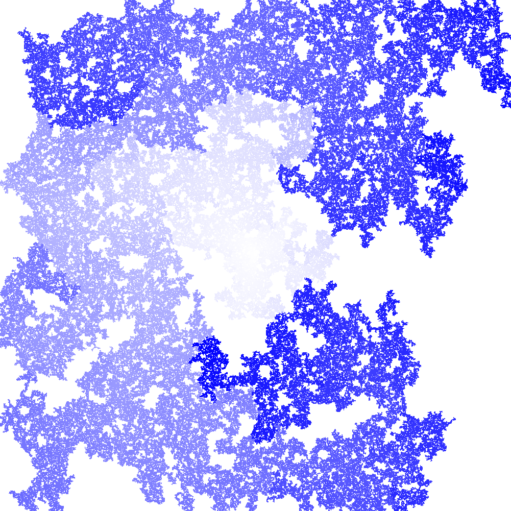
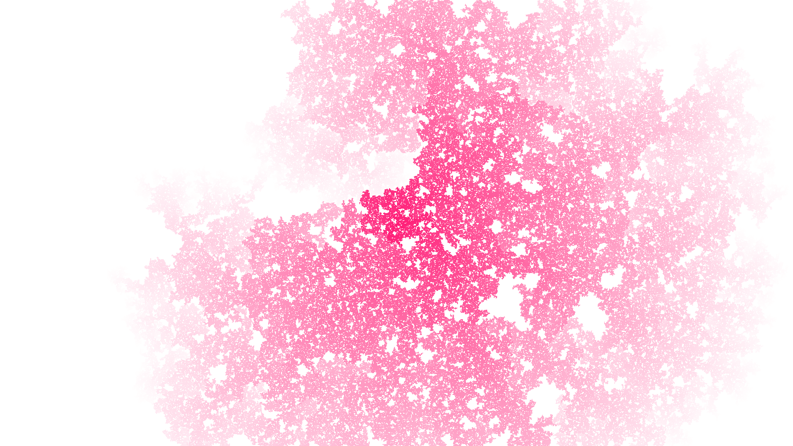
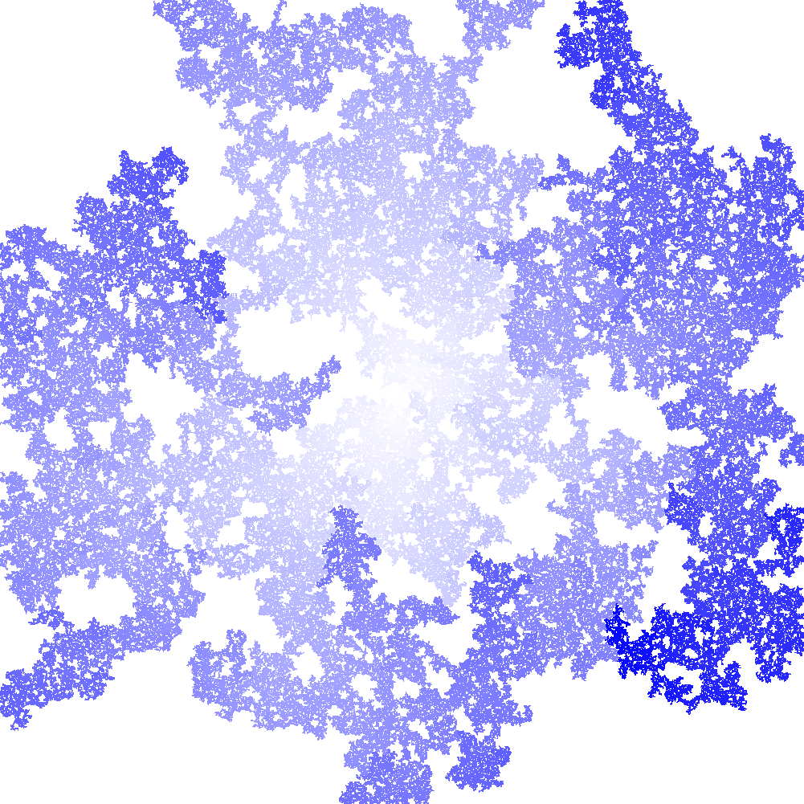
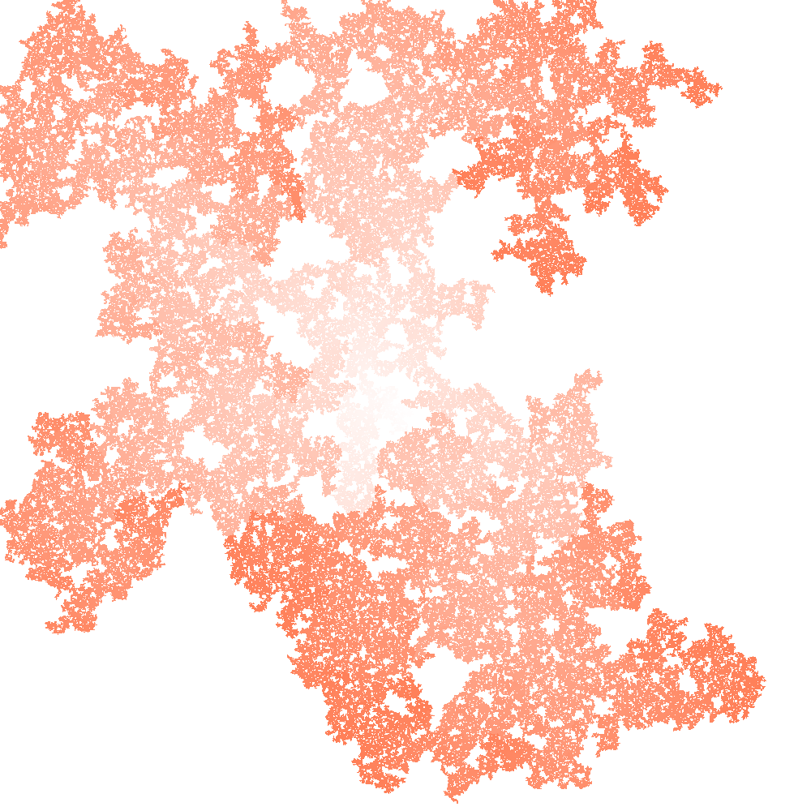

# Square colony
Visualization of an interesting mathematical idea.

## Idea
Let a square be surrounded on each side by a new square of the same size with a chance of ***q***. Newly formed squares reproduce other squares and so on, to infinity.
We will limit the growth of the population by setting a certain maximum allowable number of squares, upon reaching which the program will be completed.

## Usage
1. Upgrade required packages with `pip install -r requirements.txt --upgrade` (if you don't have one, it will be automatically installed).
2. Run the program with `python main.py --help` and check out all the parameters.
3. Run the program again with the parameters you need.
4. Enjoy the beauty.

## Command-line arguments description
```
positional arguments:
  width                 The width of the image
  height                The height of the image

optional arguments:
  -h, --help            show this help message and exit
  -rc RC, --reproduce_chance RC
                        The chance the square can produce other squares
  -mpc MPC, --max_population_count MPC
                        The maximum number of squares in the image
  -ca R G B, --color_accent R G B
                        The color of squares
  -cb R G B A, --color_background R G B A
                        The background color
  -fp FP, --find_percent FP
                        The program will work until a colony is filled with a
                        certain percentage
  -fi, --fade_in        The original color is white. The color of each new
                        generation will fade into the specified color
  -fo, --fade_out       The original color is the specified color. The color
                        of each new generation will fade out
  -s, --save            The generated image will be saved in the root
  -p PATH, --path PATH  The path by which the generated image will be saved
```

## Images created by this program





