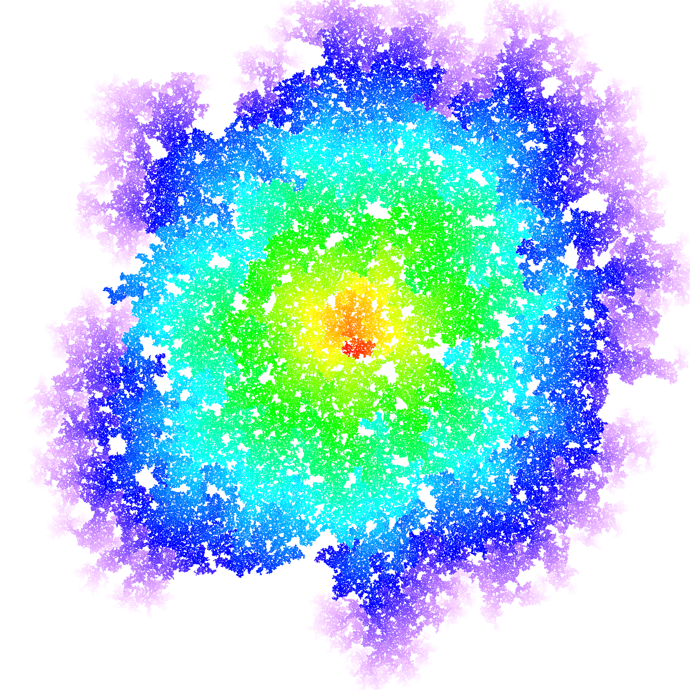
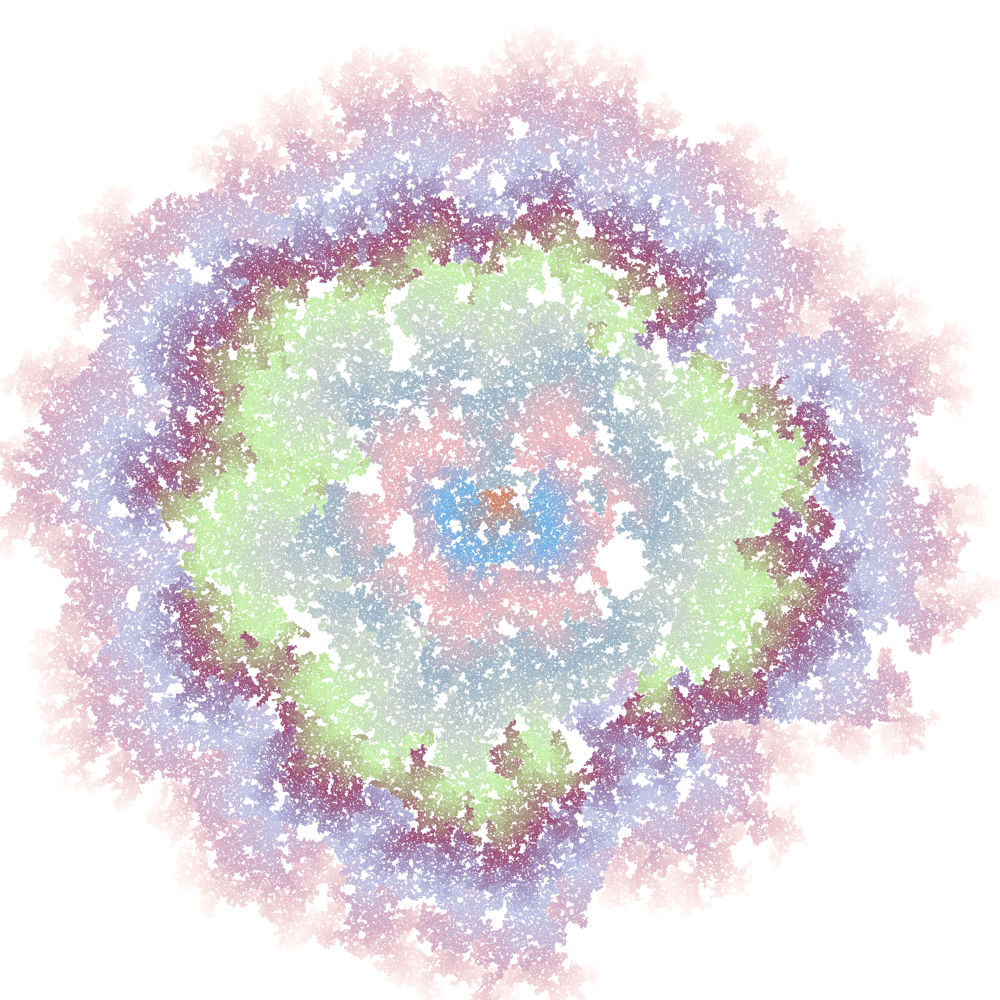

# Nebular Automata
A program for visualizing an interesting mathematical idea.

## Table of contents
- [Idea](#idea)
- [Some remarks](#some-remarks)
- [Usage](#usage)
  + [Installation](#installation)
  + [Usage of renderer](#usage-of-renderer-rendererpy)
  + [Usage of Telegram bot](#usage-of-telegram-bot-telegram_botpy)
  + [Some remarks on usage of Telegram bot](#some-remarks-on-usage-of-telegram-bot)
- [Command-line arguments description](#command-line-arguments-description)
- [License](#license)
- [Gallery](#gallery-images-created-by-this-program)

## Idea
>The original idea was found [here](https://vk.com/math_dosug?w=wall-149993556_46382), and the author is this [person](https://vk.com/id504076319).

Let a square be surrounded on each side by a new square of the same size with a chance of **q**. Newly formed squares reproduce other squares and so on, to infinity.  
We will limit the growth of the population by setting a certain maximum allowable number of squares, upon reaching which the program will be completed.

As you probably noticed when looking at the images [below](#gallery-images-created-by-this-program), the edges of the shapes have a different color, into which the initial color smoothly flows. This was done not only to illustrate the process of structure development, but also for greater saturation and prettiness of images.

## Some remarks
With **q** tending to **1**, the structure becomes more and more like a *rhombus*, that is not really surprising.  
If the **q** is less than **0.5**, then the structure is *unlikely to grow*.  
If **q** approximately equal to **0.5**, the structure is *complete chaos*.  
With **q** approximately equal to **0.6**, the structure resembles a *circle*.  
If **q** is in **\[0.7, 1)**, the the structure looks like a *convex rhombus*.  
If **q** is equals to **1**, the structure becomes a *rhombus*.

In fact, we can also generate squares if we surround each square not only on each side, but also on each corner. Therefore, I added an additional `--quadratic` parameter to generate squares.

## Usage

### Installation
Upgrade required packages with `pip install -r requirements.txt --upgrade` (if you don't have one, it will be automatically installed).

### Usage of renderer ([`renderer.py`](scripts/renderer.py))
1. Check out all the command-line parameters [below](#command-line-arguments-description).
2. Go to the ['scripts'](scripts/) folder.
3. Run the `renderer.py` with `python renderer.py [parameters you need]`.
4. Enjoy the beauty.

### Usage of Telegram bot ([`telegram_bot.py`](scripts/telegram_bot.py))
1. Check out all the command-line parameters [below](#command-line-arguments-description).
2. Add all the required information to the [`bot_config.json`](configs/bot_config.json) in the root of repository:

    1) Add your Telegram bot `token`.
    2) Add `chat_id` of your channel or chat. You can get it quickly by following my [gist](https://gist.github.com/8nhuman8/25f98c5e4b33d47a54cd510da221f309).
    3) Also set the image size.
    4) After that, you can choose to use arguments from the [`bot_config.json`](configs/bot_config.json) or enter them in the console. The difference is that using the [`bot_config.json`](configs/bot_config.json), you can specify random values of various arguments.
    5) If you chose not to use the [`bot_config.json`](configs/bot_config.json), go to step 3. If not, read on.
    6) After that, you can set the values for different parameters in the `"args"` section:
       * For `--reproduce-chance`, `--min-percent`, `--max-percent` arguments, you can specify either a specific value or an interval by specifying the `"start"` and `"end"` values. If you chose the second option, the value will be determined randomly and will lie in the interval:  
         **start <= value <= end**  
         If you don't want to use these parameters, then fill them with `null` values. If you fill `--reproduce-chance` parameter with `null` values, then by default it will be randomly determined in the range from **0.5** to **1**, including the final values.
       * `--max-count` and `--color-background` arguments aren't used by default. The default background color is white, but if you want to set your own, enter the value like this:
         ```json
         "--color-background": [0, 2, 25, 255]
         ```
       * `--multicolor`, `--opaque`, `--random-colors`, `--fade-in` and `--quadratic` parameters are flag parameters. Their JSON represantion consists of two values: `"value"` and `"random"`:

         If you want to use some of these parameters, then just set the `"value"` to `true`, and `"random"` to `false` like this:
         ```json
         "--multicolor": {
             "value": true,
             "random": false
         }

         ```
         If you don't want to use some of these parameters, then just set both values to `false` like this:
         ```json
         "--fade-in": {
             "value": false,
             "random": false
         }

         ```
         If you want to get the value randomly, then specify it like this:
         ```json
         "--fade-in": {
             "value": null,
             "random": true
         }
         ```

3. Go to the ['scripts'](scripts/) folder:
    * if you made `"use_config_args": true` in [`bot_config.json`](configs/bot_config.json): Run the [`telegram_bot.py`](scripts/telegram_bot.py) with `python telegram_bot.py`.
    * if you made `"use_config_args": false` in [`bot_config.json`](configs/bot_config.json): Run the [`telegram_bot.py`](scripts/telegram_bot.py) with `python telegram_bot.py [parameters you need]`.

### Some remarks on usage of Telegram bot
Most likely you will need a VPN to use the Telegram bot if you live in a country where Telegram is forbidden.  
I recommend using this [VPN](https://windscribe.com).

If you made `"use_config_args": false` in [`config.json`](config.json), you don't have to write `--save` and `--path PATH` parameters, because all generated images are automatically saved in ['telegram_images'](telegram_images/) folder.  
But if you want to use another folder, then create it and change the `TELEGRAM_IMAGES_SAVE_PATH` constant variable in [`constants.py`](scripts/constants.py).

## Command-line arguments description
```
usage: renderer.py [-h] [-rc FLOAT] [-mc INT] [-ca1 R G B A] [-cb R G B A]
                   [-r] [-m] [-ca2 R G B A] [--min-percent FLOAT]
                   [--max-percent FLOAT] [-fi] [-q] [-o] [-s] [-p PATH] [-si]
                   width height

Creates a beautiful nebula. Percentages show the duration of further program
execution in ideal conditions! In fact, probability can take its toll.

optional arguments:
  -h, --help            show this help message and exit

Required options:
  width                 The width of the image.
  height                The height of the image.

Basic options:
  -rc FLOAT, --reproduce-chance FLOAT
                        The chance the square can produce other squares.
  -mc INT, --max-count INT
                        The maximum number of squares in the image. By
                        default, this is half of all pixels in the future
                        image.
  -ca1 R G B A, --color-accent1 R G B A
                        The first or (primary if multicolor mode is not
                        enabled) color of squares. Color components must be
                        specified between 0 and 255. The The default color is
                        aqua
  -cb R G B A, --color-background R G B A
                        The background color. Color components must be
                        specified between 0 and 255. The default color is
                        white.
  -r, --random-colors   Accent colors will be random.

Multicoloring options:
  -m, --multicolor      Enables multicolor mode.
  -ca2 R G B A, --color-accent2 R G B A
                        The second color of squares if multicolor mode is
                        enabled. Color components must be specified between 0
                        and 255. The The default color is (r, g, b): (255, 29,
                        119, 255).

Additional options:
  --min-percent FLOAT   The program will work until nebula is filled with a
                        certain or greater percentage.
  --max-percent FLOAT   The program will work until a nebula is filled with a
                        certain percentage.
  -fi, --fade-in        The original color is white. The color of each new
                        generation will fade into the specified color.
  -q, --quadratic       Each square will be surrounded not only on each side,
                        but also on each corner.
  -o, --opaque          All colors will be opaque.

System options:
  -s, --save            The generated image will be saved in the root if no
                        path is specified.
  -p PATH, --path PATH  The path by which the generated image will be saved.
                        Write the path without quotes, separating the
                        directories with the usual single slash.
  -si, --show-image     Show image after execution.
```

## License
[Nebular automata](https://github.com/8nhuman8/nebular-automata) specific code is distributed under [MIT License](LICENSE).

Copyright (c) 2020 Artyom Bezmenov

## Gallery (images created by this program)






